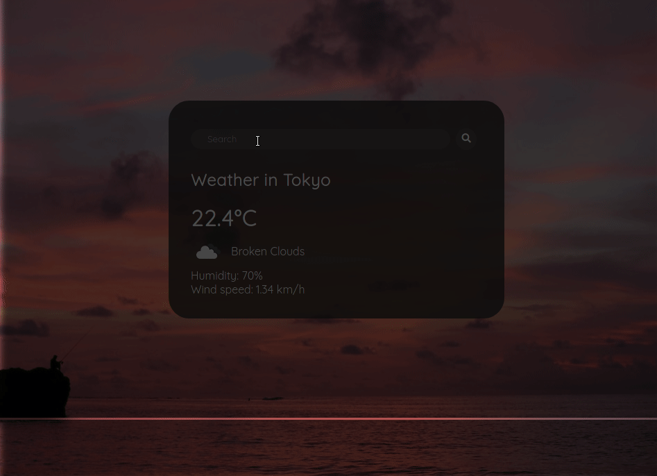

# Project: Weather app

Implementation of simple weather application from [The Odin Project](https://www.theodinproject.com/paths/full-stack-javascript/courses/javascript/lessons/weather-app) using **JavaScript**, **HTML** and **CSS**.

**Live preview** of the project is available [here](https://alternateved.github.io/weather-app/).

## **Features**

- you can **check weather** in your hometown
- application provides information such as **humidity, wind speed, temperature and description**
- application **fetches icons** from [OpenWeather](https://openweathermap.org/) for different weather situations
- application **fetches background** from [Unsplash Source](https://source.unsplash.com/) depending on gathered forecast

### **Side notes**

- learned about JavaScript promises
- learned about async/await in JavaScript
- learned how to use different APIs (OpenWeather, Unsplash Source)

### **Tools:**

- Linux terminal
- neovim
- npm
- webpack
- Git and GitHub
- ESLint + Prettier + Airbnb JavaScript Style Guide

### **Third party code:**

- [OpenWeather](https://openweathermap.org/)
- [Unsplash Source](https://source.unsplash.com/)
- [Google Fonts](https://fonts.google.com/)
- [Font Awesome Icons](https://fontawesome.com/)
